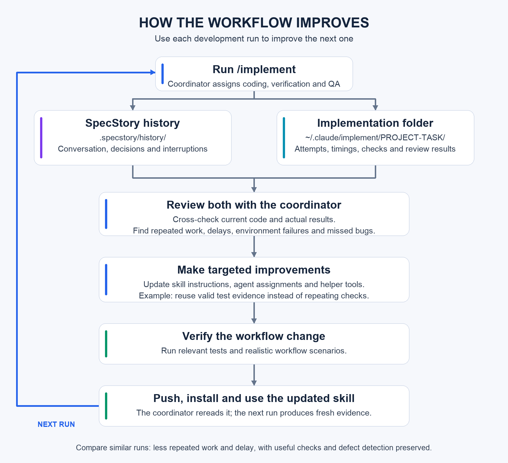

# Skills

Two Claude Code skills for implementing code changes and improving how that work runs.
**Implement** coordinates coding, checks, and independent review, with optional Codex
workers. **Improve-workflow** analyzes saved run evidence to identify delays and
verification gaps. The skills guide Claude; their helpers support individual steps.
Reusable skills by [mathaix](https://github.com/mathaix).

| Skill | What it does |
| --- | --- |
| [implement](skills/implement/SKILL.md) | A capable Claude coordinator gives scoped tasks and context to Codex workers, then integrates and verifies their work for independent final review. |
| [improve-workflow](skills/improve-workflow/SKILL.md) | Reviews execution reports and SpecStory history to find bottlenecks and improve the development workflow. |

## Install a skill

Copying a skill requires Python 3.11+. Running the documented workflow uses Claude Code,
Git, and SpecStory capture; Codex CLI is needed for delegated Codex workers. The installer
does not install or authenticate these programs. See [requirements by capability](docs/installation.md#requirements).
Implement's helpers support macOS/Linux; use WSL on Windows.

```sh
git clone https://github.com/mathaix/skills.git ~/mathaix-skills
cd ~/mathaix-skills
python3 scripts/install.py implement
python3 scripts/install.py improve-workflow
```

Each command installs only the named skill into `~/.claude/skills/<name>/`. You can install either skill independently. Existing installations are preserved unless you explicitly request replacement.

**Model access:** implement enforces its [model policy](skills/implement/model-policy.json).
Check access to the selected worker and independent reviewer before dispatching;
see [policy configuration](docs/installation.md#model-policy).

## Use the skills together

**Implement delivers the code change. Improve-workflow improves how that work gets done.**

Start Claude Code through SpecStory in your product repository:

```sh
specstory run claude --no-cloud-sync
```

Then invoke the skill:

```text
/implement Fix the input-save bug. Reproduce it locally, implement the fix, and verify the affected flow.
```

After a run, inspect its implementation records and SpecStory history:

```text
/improve-workflow Review recent runs. Find repeated work and bottlenecks, and recommend improvements without editing yet.
```

Ask improve-workflow to apply the changes you want. Use the updated skill for later development and compare the results.



## Documentation

| Guide | What you will find |
| --- | --- |
| [Start here: how the skills connect](docs/usage.md) | Choose a skill and understand the feedback loop |
| [Installation](docs/installation.md) | Requirements, personal/project setup, model policy, updates, and removal |
| [Using implement](docs/implement.md) | Requests, orchestrator and subagent roles, executable tools, and completion criteria |
| [A complete example run](skills/implement/references/example-run.md) | A small request through records, checks, review, and final response |
| [Using improve-workflow](docs/improve-workflow.md) | Audit runs, apply improvements, and measure the next run |
| [SpecStory and implementation evidence](skills/improve-workflow/references/specstory.md) | Capture history, locate records, and interpret timings |

## Repository layout

```text
skills/
  implement/        # Code-development orchestrator and executable helpers
  improve-workflow/ # Workflow analysis, feedback loop, and improvement guidance
docs/              # Collection installation and usage
scripts/install.py # Install one selected skill
tests/             # Installer tests
```

Run checks without model calls or credentials:

```sh
python3 -m unittest discover -s skills/implement/tests -v
python3 -m unittest discover -s tests -v
```

Runtime reports and SpecStory transcripts belong in local run/project directories. This repository contains the reusable skill, not real interview transcripts or private implementation history.

[MIT license](LICENSE). Spec templates follow the [Kiro feature-spec structure](skills/implement/references/spec-format.md).
