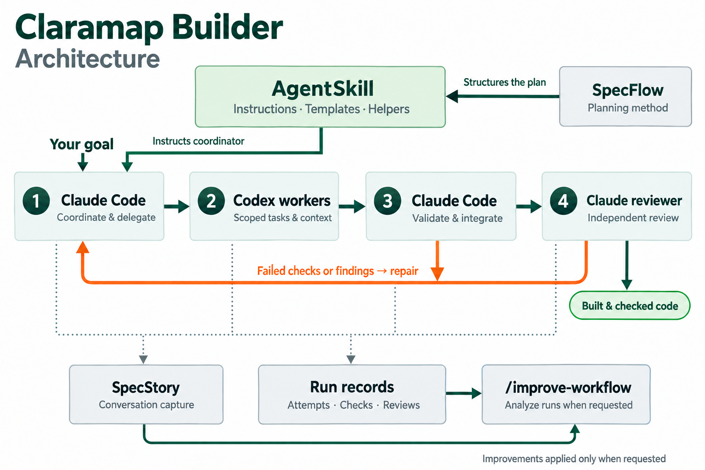

# Claramap Builder

**Agent Skills to Orchestrate Code Development.**

**Claramap Builder is an open-source AgentSkill for orchestrating code development.**
Install it in your coding harness and invoke `/implement` with a goal. It breaks the
goal into manageable tasks, gives each worker the context it needs, and selects
models based on task complexity. It validates what comes back, integrates the
changes, and iterates until the requested behavior is implemented and the required
checks pass.

The skill bundles instructions, references, spec templates, and executable helpers.
The current implementation runs on **Claude Code, Codex, and SpecStory**, with
**SpecFlow** guiding the workflow and **Kiro-style specs using EARS** structuring the
feature documents. See [attribution](#attribution).
The AgentSkill format can be adapted to other coding harnesses; the shipped setup
uses Claude Code as its host. See [harness support](docs/architecture.md#agent-skill-packaging-and-harness-support).

[Install the skill](docs/usage.md) · [How it works](docs/implement.md) · [Architecture](docs/architecture.md)

## Why I built this

I built Claramap Builder to make agent-driven development easier to coordinate,
inspect, and improve. Three goals shaped it:

1. **Orchestrate development across coding harnesses.** Package the workflow as an
   AgentSkill so its instructions, context, and development practices can travel with
   the tools I use. The current implementation connects Claude Code and Codex;
   adapting another harness means wiring its execution and review capabilities.

2. **Use a powerful orchestrator and delegate to specific subagents.** Keep the full
   goal and project context with a capable coordinator. Give each subagent a scoped
   task, the context it needs, and a model matched to the work's complexity. The
   orchestrator validates what comes back, integrates it, and drives the next iteration.

3. **Capture the work so I can improve the workflow.** Preserve conversations,
   worker attempts, check results, and review findings. Use those records to understand
   repeated work, slow handoffs, and verification gaps, then make targeted improvements
   and evaluate them on later runs.

## Architecture

[](docs/architecture.md)

See the [Architecture guide](docs/architecture.md) for the full workflow, component
responsibilities, installation requirements, and where specs and run records live.

These are separate projects used by the skill. **Set up the tools before your first
build; `scripts/install.py` only copies Claramap Builder's skill files.**

| Project | What it is and how we use it | Install beforehand? |
| --- | --- | --- |
| [Claude Code](https://github.com/anthropics/claude-code) | Anthropic's terminal coding agent. Hosts the skill, coordinates tasks and repairs, and runs a separate agent for independent review. | **Yes.** Install and authenticate; ensure access to the configured reviewer. [Setup](https://code.claude.com/docs/en/overview). |
| [Codex CLI](https://github.com/openai/codex) | OpenAI's terminal coding agent. Runs scoped workers with relevant context and a model selected for task complexity. | **Yes for delegated builds.** Install and authenticate before launching workers. Direct Claude tasks do not launch Codex. [Setup](https://github.com/openai/codex#quickstart). |
| [SpecStory CLI](https://github.com/specstoryai/getspecstory) | A tool that saves AI coding conversations as local Markdown. Captures coordinator and worker history for recovery and workflow analysis. | **Yes.** Install its CLI and enable capture before starting the documented workflow. [Setup](https://docs.specstory.com/integrations/terminal-coding-agents). |
| [SpecFlow](https://github.com/specstoryai/specflow) | SpecStory's methodology for building with software agents: intent, roadmap, tasks, execution, and refinement. Structures our specs and worker briefs. | **No.** Its planning approach is incorporated in the bundled templates and instructions. [Method guide](https://www.specflow.com/getting-started.html). |

Python 3.11+, Git, and macOS/Linux or WSL are also required for the helpers.
The [installation guide](docs/installation.md#requirements) gives the setup order and
checks. The [architecture guide](docs/architecture.md) explains capture records and
how the components connect.

## Developer workflow

### One-time setup

Install and authenticate the tools listed above, then install the skill:

```sh
git clone https://github.com/mathaix/claramap-builder.git ~/claramap-builder
cd ~/claramap-builder
python3 scripts/install.py implement
```

This copies the primary skill into `~/.claude/skills/implement`, making `/implement`
available across your projects. You do not repeat this installation for each build.
See [installation and updates](docs/installation.md) for model access, project-specific
installation, and upgrading the skill.

### For each development goal

1. **Start in your project.** Open Claude with session capture from the product repository:

   ```sh
   cd /path/to/your/project
   specstory run claude --no-cloud-sync
   ```

   When using Codex workers, keep `specstory watch --no-cloud-sync` running in another
   terminal in the relevant worktree. See [capture setup](docs/installation.md#run-claude-and-codex-through-specstory).
   An existing captured session can handle subsequent goals.

2. **Describe the outcome.** Give the skill a goal, constraints, and acceptance criteria:

   ```text
   /implement Add a display-name setting. Save it using the existing profile API,
   preserve account permissions, and verify that it survives a page reload.
   ```

3. **Build and iterate.** Claude inspects the code, creates specs where needed, and
   breaks the goal into scoped work. It gives workers relevant context, selects models
   for task complexity, validates returned work, and integrates the changes. Failed
   checks and blocking review findings return for repair; missing access or unresolved
   requirements remain explicit blockers.

4. **Inspect the result.** Review the changed code, check results, independent review
   findings, and remaining gaps. Larger changes include requirements, design, and task
   progress in **your product repository at `specs/<slug>/`**. Run evidence stays in
   `~/.claude/implement/`, and conversations in the worktree's `.specstory/history/`.
   See [Where files live](docs/architecture.md#where-files-live).

5. **Commit and publish through your project workflow.** Have the coordinator perform
   authorized Git and PR actions, or handle them yourself. Commit product specs with
   the code, keep raw run records local, and satisfy your repository's review and CI
   requirements. Specify deployment separately when you want it.

6. **Resume or improve when needed.** If interrupted, ask `/implement` to resume the
   existing run, reconcile Git and worker state, and continue remaining work. After a
   build, use `/improve-workflow` to investigate bottlenecks and recommend improvements.

The [first-build guide](docs/usage.md) provides more detail. The
[illustrative walkthrough](skills/implement/references/example-run.md) shows the
records and review process using a synthetic example.

Claramap Builder is [MIT licensed](LICENSE). Model usage runs through your existing
accounts and is subject to their billing.

## Improve how the next build runs

The companion `/improve-workflow` skill examines completed runs to find repeated work,
slow handoffs, and verification gaps. Ask why a small fix took an hour, where checks
were duplicated, or what should change before the next build.

Install it from this repository:

```sh
python3 scripts/install.py improve-workflow
```

Then ask in your project:

```text
/improve-workflow Review the last three runs. Find repeated work and bottlenecks,
and recommend improvements without editing yet.
```

It connects findings to recorded evidence and can apply targeted improvements when
requested. Compare later runs to see whether those changes helped. See the
[workflow improvement guide](docs/improve-workflow.md).

## Documentation

| Guide | Purpose |
| --- | --- |
| [Your first build](docs/usage.md) | Install, give a goal, inspect the result, and resume |
| [How orchestration works](docs/implement.md) | Task scoping, worker selection, validation, and completion |
| [Architecture](docs/architecture.md) | Claude, Codex, SpecStory, SpecFlow, capture records, and harness support |
| [Installation and configuration](docs/installation.md) | Prerequisites, model policy, project setup, updates, and removal |
| [Improve the next build](docs/improve-workflow.md) | Investigate runs and apply evidence-based improvements |
| [Illustrative walkthrough](skills/implement/references/example-run.md) | Follow a request through specs, checks, and review |
| [Contributing](CONTRIBUTING.md) | Repository structure, tests, and contribution guidance |

The installed agent instructions live in [implement](skills/implement/SKILL.md) and
[improve-workflow](skills/improve-workflow/SKILL.md). See the
[spec format and provenance](skills/implement/references/spec-format.md).

## Attribution

Claramap Builder combines existing ideas with its own orchestration and verification
helpers. Credit for the foundations belongs to:

- **[Kiro](https://kiro.dev/docs/specs/feature-specs/):** the three-file feature-spec
  layout (`requirements.md`, `design.md`, `tasks.md`), EARS-based requirements,
  tasks that cite requirement IDs, and keeping specs versioned with the code.
  See its [requirements-first workflow](https://kiro.dev/docs/specs/feature-specs/requirements-first/)
  and [version-control guidance](https://kiro.dev/docs/specs/best-practices/).
- **[EARS — Easy Approach to Requirements Syntax](https://alistairmavin.com/ears/):**
  the event-driven `WHEN … THE SYSTEM SHALL …` sentence form. Developed by Alistair
  Mavin and colleagues and first published in 2009, EARS predates both Kiro and SpecFlow.
- **[SpecFlow](https://github.com/specstoryai/specflow):** the five-phase framing of
  intent, roadmap, tasks, execute, and refine, including assigning tasks to humans or
  AI. Its [prompt-context concept](https://www.specflow.com/getting-started.html#step-41-prepare-your-ai-assistant)
  carries into our [worker briefs](skills/implement/assets/templates/brief.md).
  `/improve-workflow` applies the Refine phase to the development workflow itself.
- **[SpecStory](https://github.com/specstoryai/getspecstory):** the conversation-capture
  tooling used by the current implementation, and the publisher of SpecFlow. Its CLI
  is an installed dependency; its captured history supports recovery and workflow analysis.

The templates are our adaptations. Worker model routing, execution records, review
snapshots, and recovery helpers are Claramap Builder's implementation. Kiro, EARS,
and SpecFlow supply structure and methodology and require no separate installation
for this skill; SpecStory supplies a tool that must be installed for capture.

Built by [mathaix](https://github.com/mathaix).
