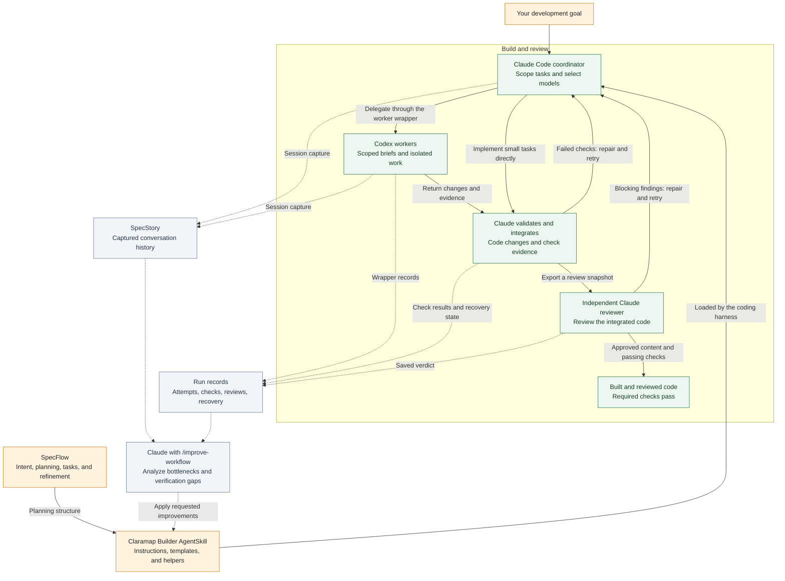

# Dependencies and architecture

[Claramap Builder](../README.md) · [Your first build](usage.md) · [Installation](installation.md)

Claramap Builder packages its orchestration workflow as an AgentSkill: instructions,
references, templates, and helpers that a coding harness can load. The current
implementation uses Claude, Codex, and SpecStory, with SpecFlow structuring the
planning workflow. Each serves a different part of the development loop.

## How everything connects



Solid arrows show the build workflow; dotted arrows show evidence capture and the
user-requested improvement loop. Claude coordinates the cycle, while the skill
supplies its instructions and helpers. SpecFlow structures the plan; SpecStory
records the conversation around execution. Capture must be configured for the
relevant sessions, and an audit starts only when requested. Missing permissions,
capabilities, or proof remain explicit blockers to completion.

## Claude: coordinate, integrate, and review

Claude Code hosts `/implement` and holds the full development goal. The coordinator
inspects the project, establishes requirements, breaks work into scoped tasks, and
chooses models and reasoning effort according to complexity, risk, and your policy.
It gives workers relevant context, allowed changes, and acceptance criteria.

When results return, Claude inspects the changes and evidence, integrates the work,
and routes failed checks or review findings back into repair. It can implement a
small, settled change directly. Coding, diagnosis, verification, and QA are available
assignments chosen for the task.

A separate Claude agent performs independent final review. The shipped
[model policy](../skills/implement/model-policy.json) selects Claude Opus for that
review and Claude Sonnet as the fallback for authorized local work a Codex worker
cannot perform. The host must provide those capabilities; the Python wrapper cannot
launch Claude. The coordinator cannot count its own review as independent.

Claude also hosts `/improve-workflow`, which analyzes run evidence and can update
instructions or helpers when asked. An audit is initiated by the user.

## Codex: execute scoped work

Codex CLI runs delegated workers. A worker gets a bounded brief with the goal it
serves, the relevant revision and files, constraints, allowed writes, and checks.
The coordinator selects an allowed model for the task's uncertainty and complexity;
the current choices and defaults are in `model-policy.json`.

The bundled `codex_task.sh` wrapper launches Codex and records prompts, session
identity, events, attempts, exit status, and observed usage. Saved settings and
session identity support resuming interrupted tasks. Locks help prevent a second
writer from starting on the same task while its worker is active.

A successful process exit means the worker finished running. Claude still needs to
validate the returned work and its checks before accepting it. Independent coding
work uses isolated worktrees and is integrated before final verification.

Codex is part of the delegated implementation path. A direct Claude change or an
audit of existing records does not need to launch a Codex worker. See
[worker dispatch](../skills/implement/references/delegation.md).

## SpecStory: capture the conversation

SpecStory preserves the conversation around the work: requests, decisions, handoffs,
interruptions, and changes in direction. This helps a resumed coordinator recover
context and lets `/improve-workflow` investigate why a run took time or repeated work.
It complements the wrapper's execution records and actual check output.

Capture is required by the documented workflow. The Python helpers can execute
without it, but that does not supply the missing conversation history. The installer
does not install or start SpecStory for you.

Launch the coordinator from the product worktree:

```sh
specstory run claude --no-cloud-sync
```

The wrapper starts delegated Codex workers directly. Keep background capture running
in another terminal in each relevant worktree:

```sh
specstory watch --no-cloud-sync
```

Verify that the relevant coordinator and worker sessions appear in the exported
history. Launching the coordinator through SpecStory does not establish that all
workers or subagents were captured. These commands request local capture; model
execution still uses the configured providers. See the
[SpecStory CLI reference](https://docs.specstory.com/integrations/terminal-coding-agents/usage)
and the [detailed capture guide](../skills/improve-workflow/references/specstory.md)
for existing-session exports, worktrees, and capture limits.

### What gets recorded, and where

| Record | Default location | What it establishes |
| --- | --- | --- |
| Requirements, design, and tasks | Product repo: `specs/<slug>/` | Intended behavior, decisions, work assignments, and reported progress |
| Worker prompts, events, attempts, and usage | `~/.claude/implement/<project>-<slug>/` | What was dispatched, observed execution, exits, and usage where available |
| Review snapshots and verdicts | Review directories in the run folder | The content submitted for review and the reviewer's response |
| Recovery state | Run folder: `recovery.json` and `recovery.md` | Last observed Git state, workers, completed commits, and next action |
| Check evidence | Commands/results beside tasks or in recovery records; logs in the run folder | The behavior exercised and the result; the coordinator must record it |
| Conversation exports | Worktree: `.specstory/history/` | Captured discussion and context surrounding execution |

`IMPLEMENT_ROOT` changes the worker record root; use matching paths for other helpers.
Recovery files are snapshots, not live monitors. Conversation history does not prove
that a test passed or that an interrupted worker stopped. Cross-check against current
Git state, worker locks, and actual results. Keep raw transcripts and run logs local;
commit the reusable specs with the product code.

## SpecFlow: specifications and task planning

Claramap Builder uses [SpecFlow](https://www.specflow.com/getting-started.html) to
structure the work from intent through planning, task decomposition, contextual
execution, and refinement. The skill incorporates this structure in its instructions,
spec templates, and worker briefs.

| Planning concept | How the skill applies it |
| --- | --- |
| Intent | Requirements record the requested outcome, constraints, non-goals, and acceptance criteria. |
| Plan | The design records the approach, decisions, and open questions. |
| Scoped tasks | Tasks identify the requirement they serve, files, executor, and check. |
| Contextual execution | Worker briefs provide relevant project context, constraints, and expected results. |
| Refinement | The coordinator validates results, repairs defects, and updates remaining work. |

The [bundled spec format](../skills/implement/references/spec-format.md) stores this
information in `requirements.md`, `design.md`, and `tasks.md`. Those filenames and
the detailed review/evidence fields are Claramap Builder conventions, not a claim
that SpecFlow prescribes this exact layout. Existing project specifications remain
authoritative inputs.

SpecFlow is used as the planning method within the skill. There is no separate
SpecFlow executable, imported package, or service to install for these helpers.

## Agent Skill packaging and harness support

[Agent Skills](https://agentskills.io/home) packages instructions and supporting
resources in a format that compatible agents can load. Claramap Builder's primary
skill is `skills/implement/`; `skills/improve-workflow/` is its optional companion.
Each includes a `SKILL.md` entrypoint and the resources needed for its role.

The format makes the workflow portable. The shipped execution integration is specific
to Claude Code and Codex CLI: the installer defaults to `~/.claude/skills`, worker
launches invoke Codex, and the review/fallback policy expects native Claude agents.
Copying the files into another harness does not automatically provide those capabilities.

To adapt another harness, configure its skill discovery path, map coordinator and
independent reviewer dispatch to its agent interface, preserve or replace the Codex
worker adapter, and configure model policy and session capture. Validate the full
request-to-review workflow in that host. This repository documents the Claude/Codex
setup; it does not establish tested compatibility with every coding harness.

Python 3.11+, Git, and macOS/Linux or WSL support the bundled helpers. Your product's
own dependencies, test services, and credentials are separate requirements. Follow
[installation and configuration](installation.md) to set up the current implementation.
