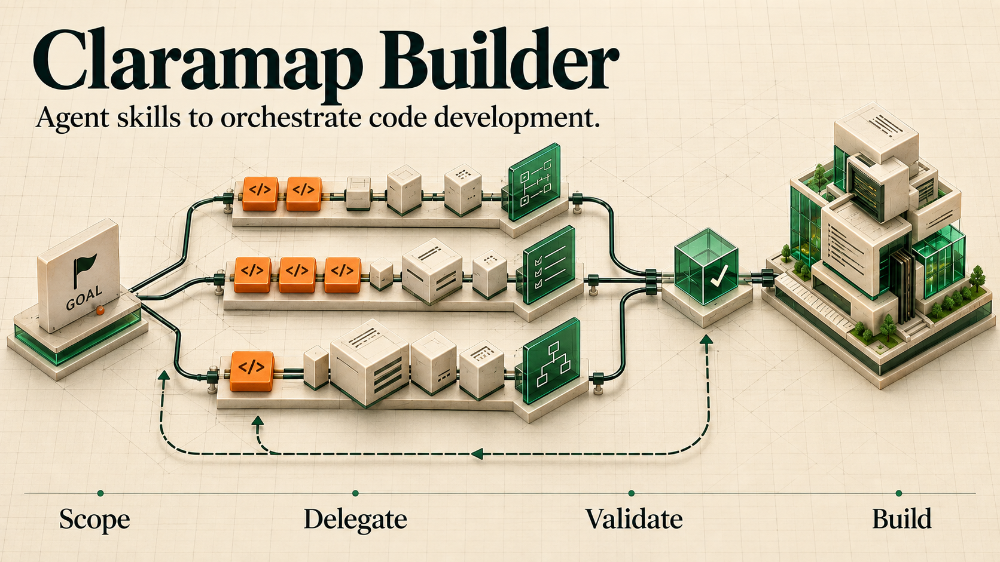

# How Claramap Builder orchestrates development

[Claramap Builder](../README.md) · [Your first build](usage.md) · [Installation and configuration](installation.md)

`/implement` is Claramap Builder's primary command. It turns a goal into scoped work,
coordinates execution, and validates the integrated result. Claude Code holds the
full goal and makes orchestration decisions; Codex workers take bounded assignments
when delegation is useful.



## Start a run

After [setup](installation.md#requirements), start Claude in your product repository:

```sh
specstory run claude --no-cloud-sync
```

Then give it a concrete outcome:

```text
/implement Fix the input-save bug. Reproduce it locally, preserve existing permissions,
and verify that the saved value survives a reload.
```

Include acceptance conditions, environment constraints, and any authorized external
steps. A request to fix code does not automatically authorize deployment or messages.
The [complete synthetic example](../skills/implement/references/example-run.md) shows a
request, run record, check evidence, review verdict, and final response.

## From goal to completed change

1. **Break down the goal.** Claude inspects the relevant code and constraints, establishes acceptance criteria, and identifies tasks with observable checks.
2. **Delegate with context.** Each worker receives the relevant revision, code paths, requirements, allowed changes, and assigned checks. Independent coding work uses isolated worktrees.
3. **Validate and integrate.** Claude inspects returned work, checks affected behavior, integrates changes, and obtains independent review of the final content.
4. **Iterate to completion.** Failed checks and blocking review findings return to the coordinator for repair. After repeated failed repairs, it reassesses the cause and approach. Missing access or authorization is reported, and unproven work stays open.

## Match workers to the work

Model selection depends on uncertainty and interaction. A mechanical change with an
established example can use a lighter worker; ordinary integrations call for more
capability; subtle state, concurrency, or permission changes need stronger reasoning.
Each brief records the selected model, effort, and reason, within your model policy
and budget. See [model routing](../skills/implement/references/model-routing.md).

Small, settled changes can be implemented directly. Coding, diagnosis, verification,
and QA are available assignments. Separate design review is used for consequential
open questions or when required by you or the repository. Independent final review
remains required.

## Keep the goal and progress recoverable

Beyond a small change, the spec lives in your repository at `specs/<slug>/`:
`requirements.md` in EARS form (WHEN ... THE SYSTEM SHALL ...), `design.md`, and a
checkbox `tasks.md` that cites requirement IDs. It is committed and reviewed with the
code, the same layout Kiro feature specs use. Execution residue such as worker records,
review snapshots, verdicts, and `recovery.json` stays under
`~/.claude/implement/<project>-<slug>/`. SpecStory conversation history lives under the
worktree's `.specstory/history/`.

## What the tools establish

| Tool result | What it verifies | What Claude must still judge |
| --- | --- | --- |
| Worker exits successfully | The wrapper received completion output | Whether the requested work is correct and complete |
| Review gate passes | The captured Git state/content and approval naming its tree match | Reviewer independence, finding dispositions, and required test success |
| Recovery reports worker and Git state | Lock state, last attempt record, HEAD, and working-tree status at that moment | Whether the work is accepted, reviewed, and ready to land |

A copied review tree contains no `.git`, ignored files, or provisioned dependencies;
submodules and escaping symlinks are rejected, and Git LFS content is not fetched. Check
results are recorded beside their task; see [verification](../skills/implement/references/verification.md).

## Useful steering

```text
Resume the existing run. Reconcile Git and worker state with specs/<slug>/tasks.md,
preserve open findings, and rerun only checks whose inputs changed.
```

```text
Use a verification agent for the real database behavior. Keep shared database writes
serialized and report anything that could not be exercised.
```

The result is done when every requirement's proof passes, required checks pass, and independent
review approves the final integrated content. Claude reports delivered behavior, evidence,
and remaining limitations. Ask [improve-workflow](improve-workflow.md) to analyze the run later.

For tool commands, see [execution](../skills/implement/references/execution.md),
[delegation](../skills/implement/references/delegation.md), and
[verification](../skills/implement/references/verification.md).
`IMPLEMENT_ROOT` changes the wrapper's run root; use the same root for other helpers' paths.
The [skill instructions](../skills/implement/SKILL.md) define coordinator behavior.
