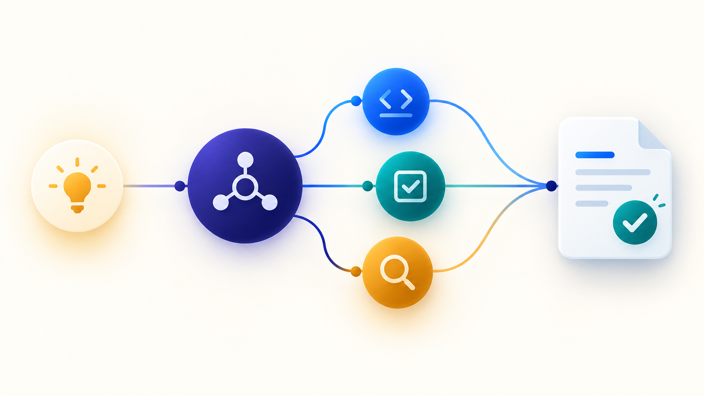

# Implement: from request to reviewed code

[All guides](usage.md) · [Installation](installation.md) · [Improve-workflow guide](improve-workflow.md)



Give Claude a feature, fix, or unfinished PR. Implement helps deliver one integrated code change with checks against your acceptance criteria and an independent final review. Claude coordinates Codex and Claude agents when the work benefits from them. For a small change, Claude can work directly.

## Start a run

Work in your product repository. With [Claude Code, Codex, and SpecStory installed](installation.md#requirements), start Claude through SpecStory:

```sh
specstory run claude --no-cloud-sync
```

Then invoke:

```text
/implement Add the requested behavior. Use existing decisions, choose appropriate tests, and verify the result.
```

Include the outcome, acceptance conditions, environment constraints, and any authorized external steps. A request to fix code does not automatically authorize deployment or messages to other people.

## How a run works

1. **Define success:** Claude reads the request and code, then records what the result must do. Larger tasks may use optional planning documents adapted from [SpecFlow concepts](../skills/implement/references/specflow.md).
2. **Build with the right crew:** Claude works directly or assigns focused jobs to Codex or native Claude agents according to complexity and available capabilities.
3. **Prove the change:** Claude integrates the work, runs relevant checks, and tests the actual user journey when needed. A worker's completion report still needs acceptance evidence.
4. **Review and deliver:** a separate Claude Opus agent reviews the complete change. Claude addresses blocking findings and reports the outcome and remaining risks.

[SpecStory](../skills/improve-workflow/references/specstory.md) separately captures conversation history for recovery and later workflow analysis.

## What the coordinator decides

The coordinator chooses whether to implement directly or use agents, how to group work, which checks to run, and when intermediate review would help. Separate planning review is reserved for unresolved consequential design questions or explicit requirements. Routine changes to test commands, filenames, or task order do not restart planning.

| Role | Responsibility |
| --- | --- |
| Coding | Implement a bounded change and run assigned focused checks. |
| Verification | Exercise specific failure conditions on a known revision and save evidence. |
| QA | Check actual user journeys and report expected versus observed behavior. |
| Diagnosis | Reproduce and investigate an uncertain cause. |
| Independent review | Review the integrated result, affected callers, and verification coverage. |

These are available capabilities, not five compulsory stages. See the [delegation toolbox](../skills/implement/references/delegation.md).

## Records and tools

By default, personal run artifacts live under `~/.claude/implement/<project>-<task>/`. A compact run starts with `status.md`; recovery files record current state. Detailed plans are added only when useful. Preserve existing runs when resuming.

| Tool | Purpose |
| --- | --- |
| [scripts/scaffold.py](../skills/implement/scripts/scaffold.py) `--compact` | Create a concise new run record. |
| [codex_task.sh](../skills/implement/codex_task.sh) `run` / `resume` | Start or resume a Codex worker with saved prompts, attempts, locks, and usage. |
| [scripts/check_evidence.py](../skills/implement/scripts/check_evidence.py) `run` / `status` | Record a check or verify whether previous evidence is reusable. |
| [scripts/review_gate.py](../skills/implement/scripts/review_gate.py) `snapshot --base <commit>` | Capture the entire integrated change for final review. |
| [scripts/review_copy.py](../skills/implement/scripts/review_copy.py) | Export the reviewed source into an isolated copy. |
| [scripts/run_state.py](../skills/implement/scripts/run_state.py) | Record current Git/worker state and the coordinator's planning decision. |
| [codex_task.sh](../skills/implement/codex_task.sh) `cost` | Summarize observed worker tokens without inventing billed costs. |

Tool paths above are relative to the installed implement skill. Full commands are in the [execution guide](../skills/implement/references/execution.md) and [verification guide](../skills/implement/references/verification.md). `IMPLEMENT_ROOT` changes the worker wrapper's run root; use that same root for explicit scaffold/check/recovery paths.

## Examples of useful steering

```text
Use a coding agent for the change and a verification agent for the database behavior. Keep shared database operations serialized.
```

```text
Reuse the passing unit-test evidence if its inputs still match. Run QA against the actual local landing journey and report anything not exercised.
```

```text
Resume the existing run. Reconcile Git and worker state first. Keep the open findings and avoid rerunning unchanged checks.
```

## What counts as done

The acceptance criteria are met, repository-required checks pass, and an independent reviewer has approved the integrated content. A worker exit code, an old deployment result, or a mocked test alone cannot prove the whole journey. Changed code requires review of that delta and its consequences; valid prior review coverage remains useful.

A copied review tree has no `.git`, ignored files, or provisioned dependencies. The exporter rejects submodules and escaping symlinks and does not fetch Git LFS content. Prepare a suitable separate environment when a check needs those features; do not mislabel a skipped check as passed.

Use [SpecStory with the implementation reports](../skills/improve-workflow/references/specstory.md) to inspect delays, recover context, and improve future task selection.

Continue with the [improve-workflow guide](improve-workflow.md) when you want to analyze these records and improve future runs. The [implement skill instructions](../skills/implement/SKILL.md) define the orchestrator’s behavior.
