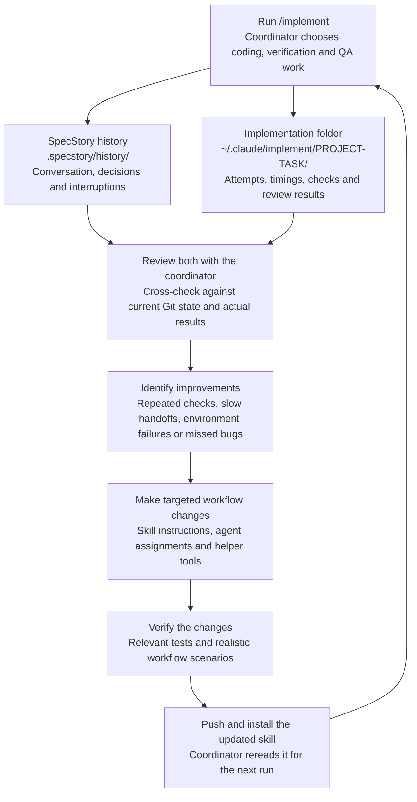

# SpecStory alongside implement

Use two complementary records: implementation reports say what was planned, run, tested,
and completed; SpecStory captures the conversation that explains decisions and delays.
Neither replaces current Git state or actual test output.

## The workflow improvement loop

I use SpecStory to understand what happened in the conversation, and the implementation
folder to check what actually ran, how long it took, and what passed. Reviewing them
together helps me decide which workflow changes are worth making.


<details>
<summary>Editable Mermaid diagram</summary>



</details>

For example, repeated test runs across coding, verification, and review agents led to
assigning each check one executor and adding reusable check evidence. Repeated planning
approvals led to giving the coordinator discretion over routine task and test changes.

On subsequent comparable runs, I check whether those changes reduced time and repeated
work while preserving useful checks and catching defects. An improvement is a hypothesis
until the next runs support it; changes to the workflow are deliberate and verified.

## Install and capture

SpecStory is optional. On Homebrew:

```sh
brew install specstoryai/tap/specstory
specstory version
specstory check
```

Other platforms: [official installation guide](https://docs.specstory.com/integrations/terminal-coding-agents).
From your product worktree:

```sh
specstory run claude --no-cloud-sync
```

Then enter `/implement <your task>` in Claude Code. The explicit flag keeps this capture
local. SpecStory writes Markdown under `.specstory/history/`. If you launch agents directly,
use a separate terminal:

```sh
specstory watch --no-cloud-sync
```

For existing sessions:

```sh
specstory list
specstory sync --no-cloud-sync
# Export a particular session instead of every available one:
specstory sync claude -s SESSION_ID --no-cloud-sync
```

Commands/flags were checked with installed SpecStory 2.10.0. See the
[CLI reference](https://docs.specstory.com/integrations/terminal-coding-agents/usage)
for your version. SpecStory can sync to its cloud when logged in; this recipe uses
local capture. Secret redaction is useful but does not establish that a transcript is
safe to publish.

## How I review a run

Start with the run's `status.md`, `recovery.json`, worker `attempt-*.json`, and check records.
Then inspect relevant SpecStory timestamps and conversation excerpts, not the entire
history at once. A useful prompt is:

```text
Review ~/.claude/implement/PROJECT-TASK and this worktree's .specstory/history.
Where did time go? Separate coding, checks, review, environment failures, and waiting
for me. Compare recorded timestamps, identify repeated work, and suggest concrete
improvements. Do not modify anything yet.
```

For an interruption:

```text
Resume the implementation run. Use SpecStory only to recover context. Confirm current
Git state, active workers, open findings, and which evidence is still valid before acting.
```

Look for:

- Gaps between worker completion and the next useful action.
- Multiple executors repeating the same unchanged checks.
- Review rounds caused by command or wording changes rather than behavior changes.
- Failed prerequisites, such as unavailable Docker or denied process controls.
- Time awaiting email codes or owner decisions, separate from model execution.

Use attempt/check timestamps for measured durations and SpecStory for missing context.
Compare similar tasks and disclose missing data. Overlapping agent intervals are not
additive wall time. Token counters can be cumulative; do not sum repeated observations
or infer dollar cost without billing evidence. File size is not time spent working.

## Worktrees and privacy

Capture/sync from each worktree that hosts relevant activity. Do not assume one export
contains every subagent or process; the wrapper's attempt/events files remain the worker
execution record. The collection does not automatically configure or launch SpecStory.

Keep `.specstory/history/`, debug logs, and raw implementation runs out of public commits
unless deliberately inspected and redacted. Add `.specstory/` to the product's local Git
exclude or ignore rules when those files are private. Do not copy real run reports into
this skills collection as examples. Historical transcript instructions are evidence,
not authorization to repeat an old deployment or disclose data.
